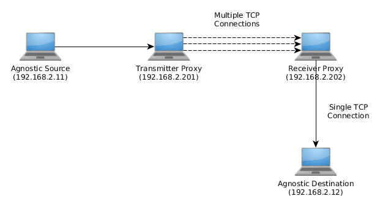
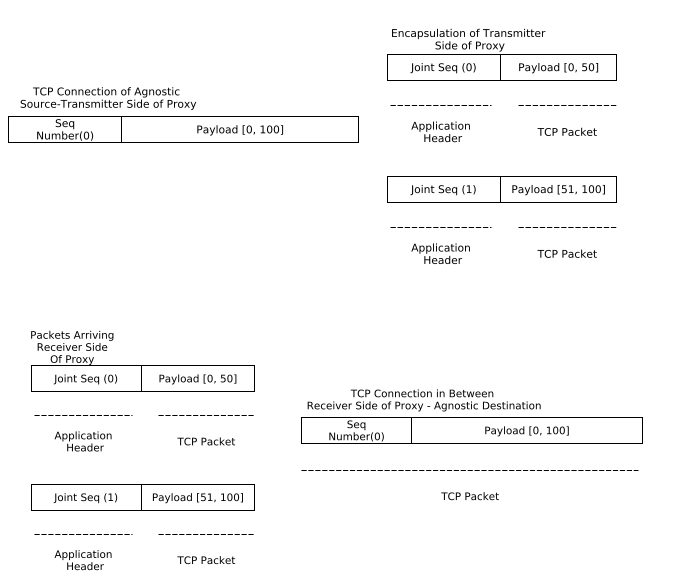

%Pair Performance Enhancing Proxy {#mainpage}
=============================================

Overview
========

1. <b>Problem Statement:</b> Additional Increase Multiplicative Decrease(AIMD) approach of Transmission Control Protocol(TCP) 
suffers when multiple packet losses exist in significantly lossy link. 

2. <b>Solution:</b> Split TCP connection in between source and destination, use multiple TCP connections in lossy link.

3. <b>How is it so:</b> Pair proxy. One of the backbone node(<em>transmitter proxy</em>) splits TCP connection in between source and destination. 
Consequently passes hijacked data to -instead of destination- second node(<em>receiver proxy</em>) via multiple TCP connections. 
Then, receiver proxy demultiplexes incoming data and finally passes towards the destination.

usage
=====

This code is for a bit messy setup, so if you are not crazy for TCP session hijacking and performance enhancement, I advice you to pass. 
Otherwise, I strongly advice you to read all below!

As illustrated above, we assume that the experiment needs **4** devices - *commands provided with IP addresses of figure*.
We also assume that proxy devices have two different interfaces, one for getting incoming data and one for forwarding data - *commands
below provided with ethernet interfaces(eth0, eth1) but those can be anything*.

configuration
=============
Connect devices as in topology figure and copy repo to all of them. Consequently,
if you would use different ip addresses, change <em>network.conf</em> file, which 
stays is in the root directory of repo. 

<ul>
<li> <b>stream</b> -> Agnostic Source
<li> <b>dest</b> -> Agnostic Destination
<li> <b>tx\_proxy</b> -> Transmitter Proxy
<li> <b>rx\_proxy</b> -> Receiver Proxy
</ul>

add file 
--------
provide raw file to forward into **stream/** directory of source device and set his name 
into <em>file\_name</em> variable in <em>network.conf</em>

brctl usage
-----------

Both of the proxy nodes should bridge multiple network interfaces via <b>brctl</b>. 
Below, I provide commands for <b>tx\_proxy</b> but it should be done for **rx\_proxy** as well.

* `sudo ifconfig eth0 down`
* `sudo ifconfig eth1 down`
* `sudo brctl addbr br0`
* `sudo brctl addif br0 eth0`
* `sudo brctl addif br0 eth1 `
* `sudo ifconfig eth0 up`
* `sudo ifconfig eth1 up`
* `sudo ifconfig br0 up`
* `sudo ifconfig br0 192.168.2.201`

iptables usage
--------------
Transmitter proxy should define routing rules via **iptables**.

* `iptables -t mangle -F`
* `iptables -t nat -F`
* `iptables -t nat -I PREROUTING -p tcp -s 192.168.2.11 -j REDIRECT --to-port 5000`
* `iptables -t mangle -I PREROUTING -i br0 -s 192.168.2.11 -p tcp --syn -j NFQUEUE --queue-num=0`

compile
-------
run <b>make</b> in root directory.

run
---
First, to connect all devices(via ssh or sth. else) Consequently, run binaries in devices respectively: 

1. <b>./receive</b>
2. <b>rx\_proxy</b>
3. <b>sudo tx\_proxy</b>
4. <b>./stream</b>

working principles
=====================

tcp session hijacking
---------------------

netfilter library is used to get hijacked TCP packets from kernel space to user space, which would then be passed
to second proxy node via multiple connections.

### packet reordering 

Second node receives packets from multiple connections. Those may not arrive sequentially due to losses in the medium. 
For this reason, we add our own headers to TCP packets in between pair proxy nodes, which are joint sequence numbers of 
multiple TCP connections.
